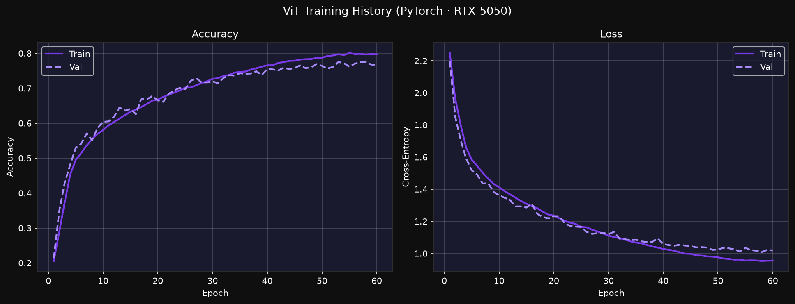
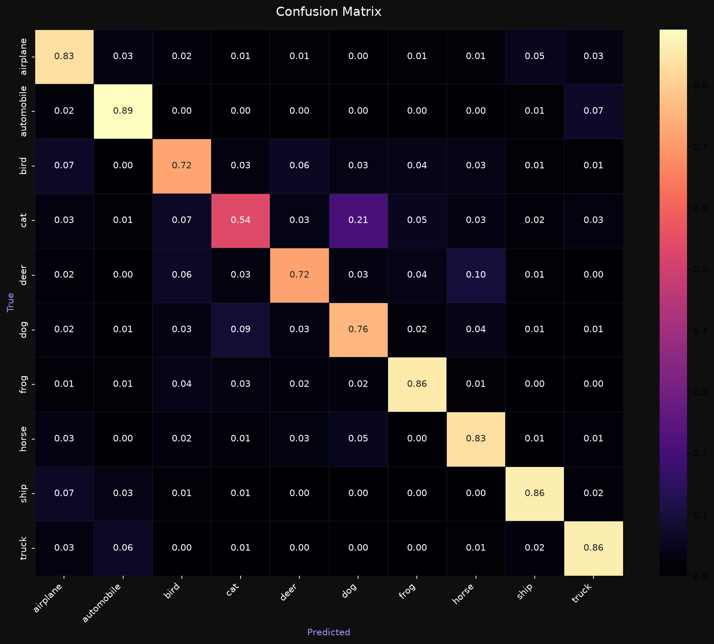
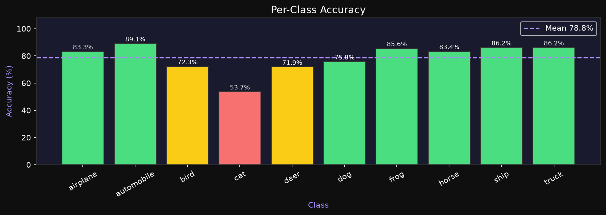

# Vision Transformer (ViT) on CIFAR-10

A Vision Transformer built from scratch in PyTorch, trained on CIFAR-10, and served through a Flask web app and REST API.

**78.8% test accuracy** with a compact **326,602-parameter** model trained on an RTX 5050 (no pretraining; best checkpoint at epoch 53, 77.5% validation accuracy).



## Results

| Class | Accuracy | Class | Accuracy |
| --- | --- | --- | --- |
| automobile | 89.1% | horse | 83.4% |
| ship | 86.2% | airplane | 83.3% |
| truck | 86.2% | dog | 75.8% |
| frog | 85.6% | bird | 72.3% |
| deer | 71.9% | cat | 53.7% |

Vehicles, which have rigid shapes, score highest. Cat is the hardest class because at 32×32 it is often confused with dog.

| Confusion matrix | Per-class accuracy |
| --- | --- |
|  |  |

## Architecture

```
32×32×3 image
  → Conv2d(3→64, kernel 4, stride 4)       # 8×8 = 64 patch tokens, dim 64
  → prepend [CLS] token, add learnable positional embeddings (65 × 64)
  → 6 × Transformer block (pre-norm)
        LayerNorm → Multi-head self-attention (8 heads) → residual
        LayerNorm → MLP 64→256→64 (GELU, dropout 0.1) → residual
  → LayerNorm → [CLS] output → MLP head 64→256→10 → logits
```

| Training setting | Value |
| --- | --- |
| Split | 45,000 train / 5,000 validation (seed 42) / 10,000 test |
| Augmentation | random horizontal flip, random crop (pad 4), colour jitter |
| Loss | cross-entropy with label smoothing 0.1 |
| Optimiser | AdamW, lr 1e-3, weight decay 1e-4 |
| Schedule | 5-epoch linear warm-up, then cosine decay to 1e-6 |
| Other | mixed precision (GPU), gradient clipping at 1.0, early stopping (patience 15) |

## Project structure

```
src/
  vit_model.py            ViT model, DEFAULT_CONFIG, build_vit()
  data_preprocessing.py   transforms, normalisation, DataLoaders
  train.py                training loop → models/vit_cifar10_torch.pth
  evaluate.py             test-set metrics and plots → docs/
  inference.py            load checkpoint, preprocess, predict (shared by app)
app/
  app.py                  Flask API + web UI
  templates/index.html
tests/test_pipeline.py    27 unit tests (no dataset download or GPU needed)
notebooks/exploration.ipynb
```

## Quick start

```bash
python -m venv venv && source venv/bin/activate
pip install -r requirements.txt        # GPU: install the CUDA build of torch first

python src/train.py                    # trains and saves models/vit_cifar10_torch.pth
python src/evaluate.py                 # accuracy, report, confusion matrix
python app/app.py                      # http://localhost:5000
pytest tests/ -v
```

## API

| Method | Path | Description |
| --- | --- | --- |
| GET | `/` | Web UI (drag and drop an image) |
| POST | `/predict` | multipart field `image` → class, confidence, all 10 probabilities, top 3 |
| POST | `/predict/demo` | Same response shape with random values (UI testing without a model) |
| GET | `/health` | `{"status": "ok", "model_loaded": ..., "model_available": ...}` |
| GET | `/classes` | Class names and emoji |

```bash
curl -F "image=@cat.jpg" http://localhost:5000/predict
```

Errors: 400 (no file or unreadable image), 413 (over 10 MB), 415 (unsupported file type), 503 (model file missing).

## Deploy

The app loads `models/vit_cifar10_torch.pth` (override with the `MODEL_PATH` environment variable). The checkpoint is about 1.3 MB and is committed to the repo so Docker, Render and Cloud Run builds work from a clean clone.

**Docker**

```bash
docker build -t vit-cifar10 .
docker run -p 8080:8080 vit-cifar10      # http://localhost:8080
```

**Google Cloud Run**

```bash
gcloud run deploy vit-cifar10 --source . --region asia-south1 \
  --allow-unauthenticated --memory 1Gi
```

**Render**: connect the repo; `render.yaml` sets up the build and health check.

## References

Dosovitskiy et al., *An Image is Worth 16x16 Words: Transformers for Image Recognition at Scale* (2020). [arXiv:2010.11929](https://arxiv.org/abs/2010.11929)
